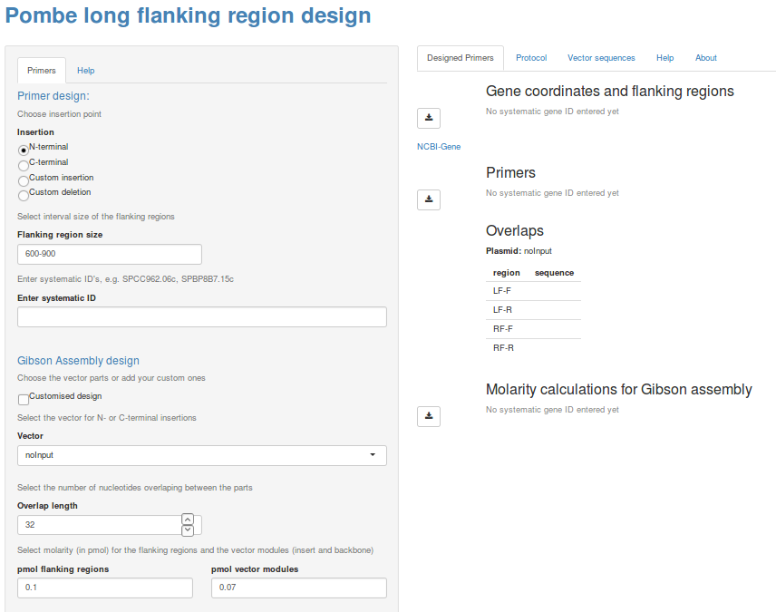
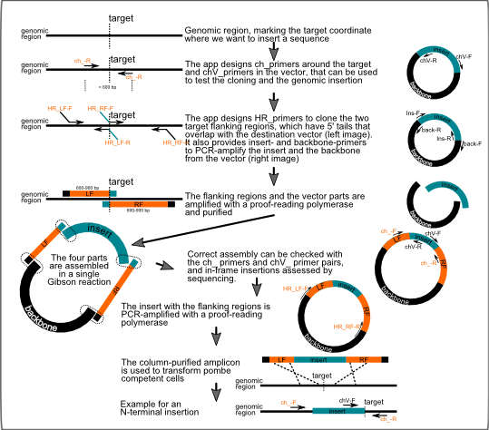

# README file contents:  

1. PombePrimer  
2. What is this app for?  
3. Installation instructions  
4. How to run the app  
5. Description of contents of the github repository  
6. Screenshots  


# 1. PombePrimer  
Shiny app to create fission yeast mutants. It designs N-terminal, C-terminal and custom insertions and deletions, and provides primer design for cloning and construct testing, a destination vector collection and custom options for cloning, and Gibson assembly conditions.  

Credits:  
This app was designed by [Dr. Ruben Alvarez](https://www.linkedin.com/in/rubenalvarezfernandezcreative/), in the laboratory of [Dr. Juan Mata](http://www.bioc.cam.ac.uk/people/uto/mata), at the Department of Biochemistry in the University of Cambridge (UK). PombePrimer was made with the package [Shiny](https://www.rstudio.com/products/shiny/) in [R](https://cran.r-project.org/), and [primer3](https://sourceforge.net/projects/primer3/?source=directory).


# 2. What is this app for?  

Stable gene manipulation in fission yeast is usually achieved by transfecting plasmids or PCR products in the cell. The transfected DNA contains a region of interest flanked by sequences homologous to the target, which then replaces the target by means of the native homologus recombination machinery.  

In most cases, flanking regions of 80 bp are enough for successful recombination. However, when selective pressure against the insertion gets higher, the transformation efficiency drops. The longer the flanking regions, however, the most efficient the transformation.  

This app complements existing tools (see the *Pombe PCR Primer Programs* by the [Bahler lab](http://www.bahlerlab.info/resources/)) providing a means to clone long flanking regions: it designs primers for both cloning and validating constructs, hosts a list of recipient backbones and options for custom vectors, and also returns the final cloned vectors using Gibson assembly.  

# 3. Installation instructions  
### Installation:  
1. Download the app from the repository: in the main page (https://github.com/rubenalv/PombePrimer), go to the button "Clone or Download", click on "Download ZIP", and once downloaded unzip the file. This zip contains both Windows and Linux versions and all neccesary to run the app but R. If you clone the app from the git repository you will get [primer3](https://sourceforge.net/projects/primer3/files/primer3/2.3.7/) with it.  
2. You need [R](https://cran.r-project.org/) and optionally [RStudio](https://www.rstudio.com/products/rstudio/download/). RStudio is not necessary, but it is well integrated with the Shiny package.  
3. You need to install these packages in R (run the following code in the R console, see links for further information):  
* Shiny ([CRAN download](https://cran.r-project.org/web/packages/shiny/index.html), [RStudio-Shiny description](https://www.rstudio.com/products/shiny/))  
```
install.packages("shiny")
```
* Biostrings ([Bioconductor download](https://www.bioconductor.org/packages/release/bioc/html/Biostrings.html))  
```
source("https://bioconductor.org/biocLite.R")
biocLite("Biostrings")
```  
Package versions tested with the app:  **Shiny 1.0.5** and **Biostrings 2.44.0** in **R 3.4.3**, calling **primer3 2.3.7**.  

## Windows and Linux versions:  
Both versions are almost identical, differing only in the primer3 installation and the way primer3 is called in server.R.  

*As a note, primer3 can be called from a different R working directory on Linux (e.g. you can call it like "dir1/dir2/primer3_core"), but this does not work on Windows. In the latter case, you can only call (as far as my experience has proven) primer3 when the working directory is the one hosting primer3_core.exe.*  

# 4. How to run the app
*You can find general information on how to run a Shiny app in the [RStudio-Shiny website](https://shiny.rstudio.com/articles/running.html)*. When you run the app, a new window will open in your default internet browser, showing the main page of the app (see the screenshots at the end of this README).  

To run the app from command line (from Windows or Linux), replace the *~/appdirectory/* below by the app root directory (path where the global.R is stored, choosing the Windows or Linux version as appropriate):  
```
R -e "shiny::runApp(appDir = '~/appdirectory/', launch.browser = TRUE)"
```

To run the app from R, open R, set the working directory (*File > Change Dir*) to the app root directory (Windows or Linux version as appropriate), and run:  
```
shiny::runApp()
```

To run the app from RStudio, open (*File > Open File*) any of global.R, ui.R or server.R (from the Windows or Linux version as appropriate) and press the *Run App* (Run the Shiny application) button in the code editor panel.

# 5. Description of contents of the github repository   

#### data/ folder:  
* **pombe_genome.RData**: This primer design app uses genomic sequences from 2016, named Schizosaccharomyces_pombe.ASM294v2.30.dna.I.fa.gz (dna.I, dna.II and dna.III for each of the chromosomes), which are stored with CDS coordinates (ch.cds) and gene mapping ID's (namemap) in the data/pombe_genome.RData file.  
* **Rscript_updateVectorSequences.R**: This script is used to update the app with vector data (from vectorsequences.txt), and creates a new vectorData.RData and text to manually update ui.R.  
* **vectorData.RData**: this file contains the R data with the vector sequences, and is loaded from global.R.  
* **vectorsequences.ods, vectorsequences.txt**: these are spreadsheets that contain the vector data to be converted into vectorData.RData with Rscript_updateVectorSequences.R.  

#### ResourcesAndDownloads/ folder:  
It contains the tar.gz and compiled (in the linux version of the app) versions or primer3.2.3.7, which is called in server.R to do the primer design.  

#### www/ folder:  
*www* is a reserved name in Shiny, and contains all the materials that are uploaded from the app (with exception of primer3, which is in ResourcesAndDownloads/).  

* **Cloning_protocol.docx**: a description of the Gibson cloning approach, also displayed in HTML in the app.  
* **pombeprimer_protocol.\***: graphic description of the cloning approach in various formats (.svg, .pdf and .png).  
* **vectorMaps/**: this folder contains all the vector maps available to download from the app, in GenBank (.gb) and GenomeCompiler (.gcproj).  

#### global.R, server.R, ui.R: 
R scripts required by the Shiny package. The can be merged into a single script, but split this way they are more manageable. *Global.R* contains the libraries and data to be loaded when the app launches. *ui.R* codes the user interface, and *server.R* codes all data processing and output generation.  

# 6. Screenshots:  

PombePrimer app:  


Cloning protocol:  

